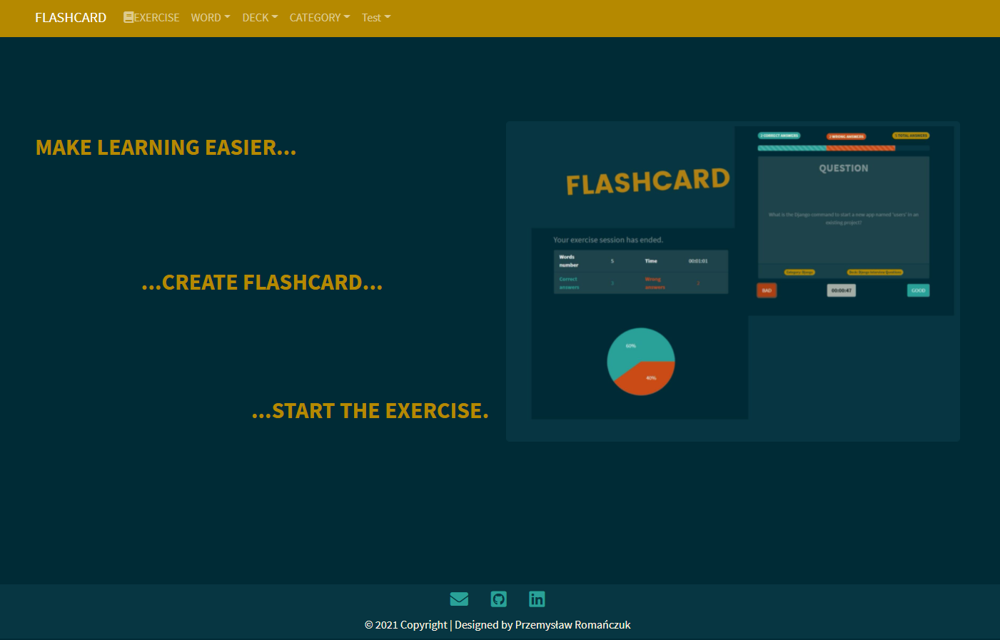
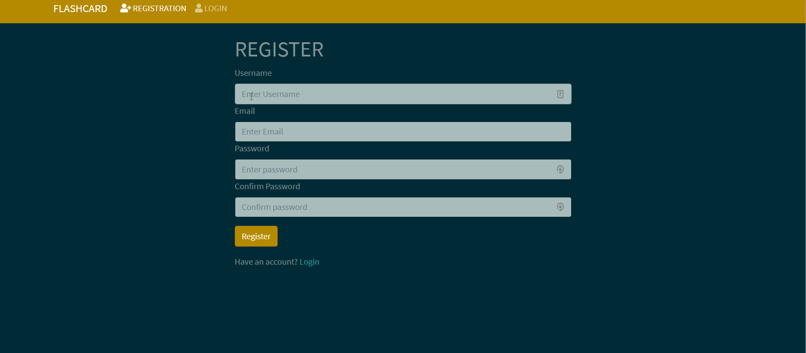
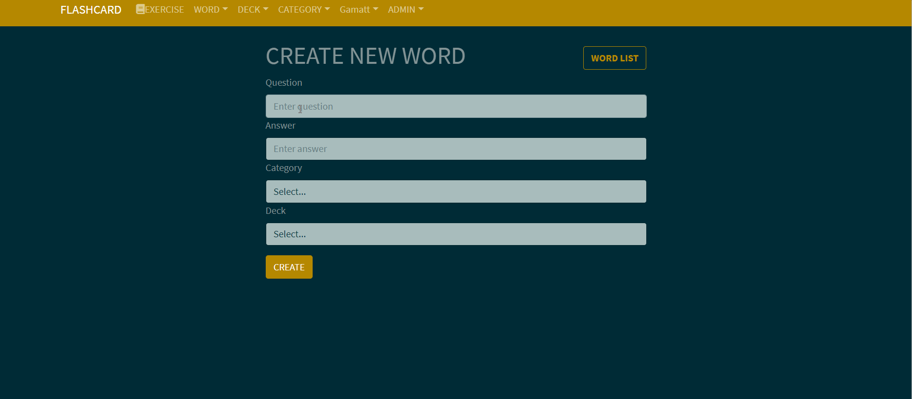
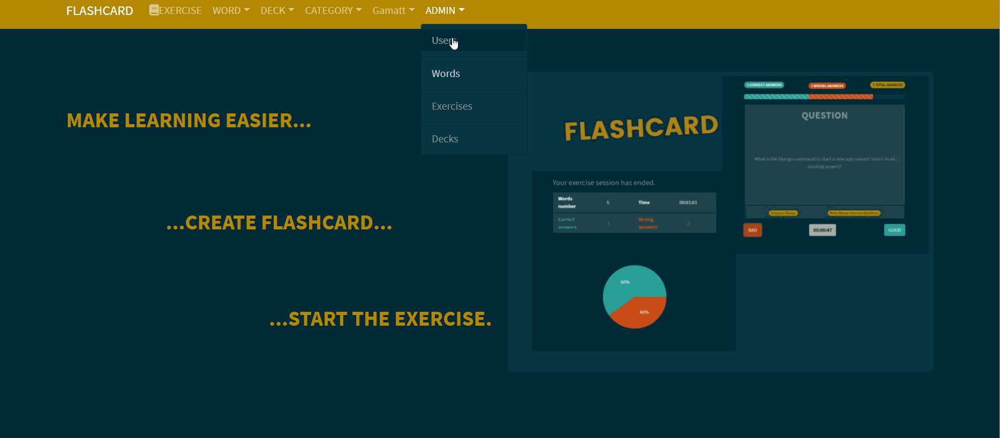
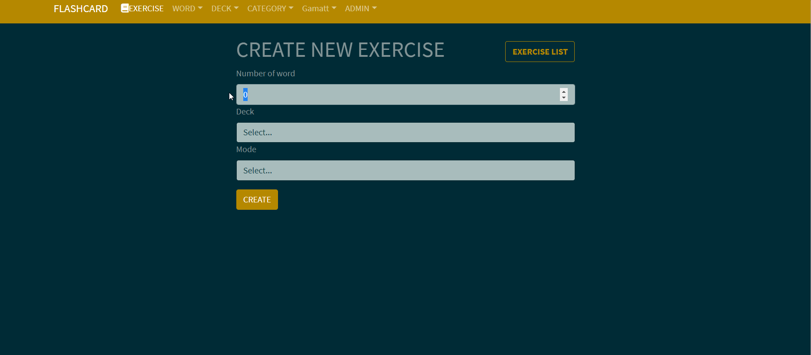
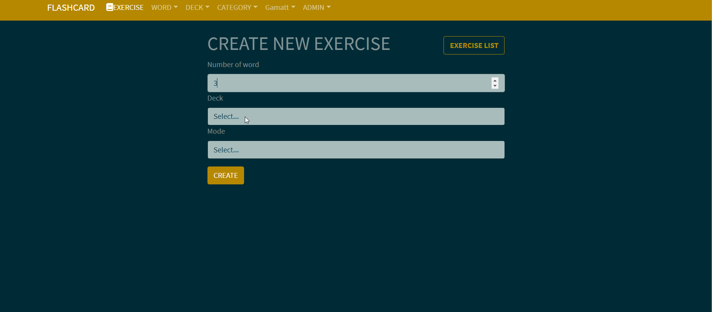
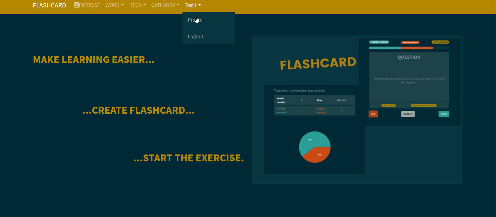

<div align="center">
<h1 align="center">FLASHCARD</h1></div>



## Table of contents
* [General info](#general-info)
* [Technologies](#technologies)
* [Demo](#demo)
* [Setup & Installation](#setup-&-installation)
* [Running The App](#running-the-app)
* [Viewing The App](#viewing-the-app)
* [Features](#features)
* [Status](#status)
* [Contact](#contact)

## General info
 **Flashcard** is a full-stack web application created in **Django REST Framework** and **ReactJS**. It will help you memorize the most important vocabulary in a quick and easy way.

## Technologies
* Python 3.9.x
* Django 3.2.x
* Django REST framework .12.x
* React 17.0.x
* Redux 4.1.x
* SQLite3/PostgreSQL
* Bootstrap 5
* HTML5
* CSS3

## Demo
Check app demo [here.](https://flashcard-gamattowicz.herokuapp.com/)

## Setup & Installation

**Backend configuration**

Make sure you have the latest version of Python and pip installed

Clone the repository using the following command
```bash
git clone https://github.com/Gamattowicz/Flashcard.git
```
Create a virtual environment
```bash
python -m venv venv
```
Active the virtual environment
```bash
.\venv\Scripts\activate
```
Install all the project Requirements
```bash
pip install -r requirements.txt
```
Create an .env file to save your environment variables in main directory, where <secret_key_name> is your sensitive data.
```bash
SECRET_KEY=<secret_key_name>
```
Create your database
```bash
python manage.py makemigrations
```
```bash
python manage.py migrate
```

**Frontend configuration**

[Install Node.js](https://nodejs.org/en/) and Node Modules:


Move to directory ```frontend```.
```bash
cd frontend
```
Next install all dependencies.
```bash
npm install
```

## Running The App
In main directory run django web server:
```bash
python manage.py runserver
```
Move to directory ```frontend```.
```bash
cd frontend
```
Run the production compile script
```bash
npm run build
```
or for development:
```bash
npm run dev
```

## Viewing The App
Go to `http://localhost:3000/`

## Features
* User management system 

* CRUD operations at words, categories, decks 

* Admin panel 

* Two exercise modes (reversed and typed) to learn vocabulary 

* Easy change of username, mail and password in profile 


**To Do:**
* Add tests
* Add option to import/export words to/from CSV file

## Status 
Project in progress.

## Contact
Created by [@Gamattowicz](https://github.com/Gamattowicz) - feel free to contact me!
